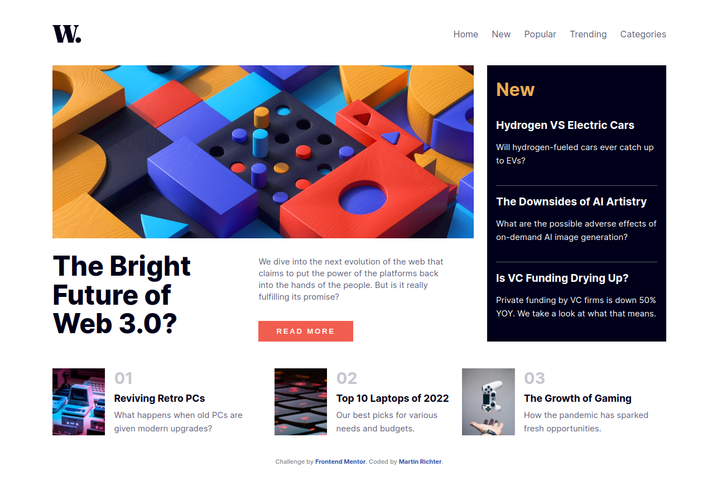
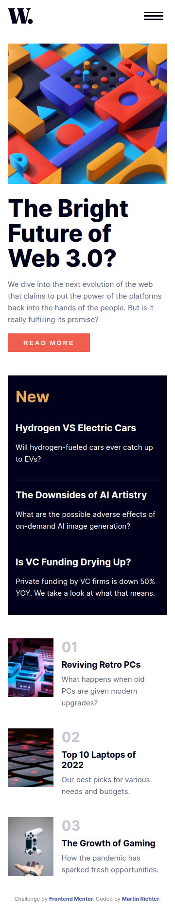
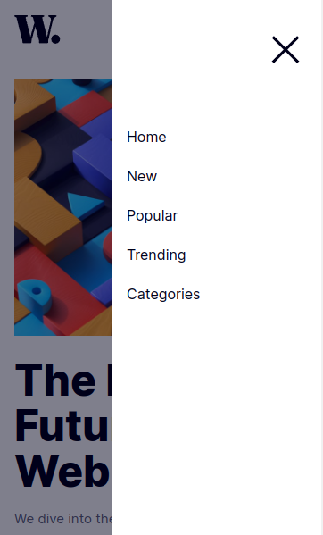

# Frontend Mentor - News homepage solution

This is a solution to the [News homepage challenge on Frontend Mentor](https://www.frontendmentor.io/challenges/news-homepage-H6SWTa1MFl). Frontend Mentor challenges help you improve your coding skills by building realistic projects.

## Table of contents

-   [Overview](#overview)
    -   [The challenge](#the-challenge)
    -   [Screenshot](#screenshot)
    -   [Links](#links)
-   [My process](#my-process)
    -   [Built with](#built-with)
    -   [What I learned](#what-i-learned)
-   [Author](#author)

## Overview

### The challenge

Users should be able to:

-   View the optimal layout for the interface depending on their device's screen size
-   See hover and focus states for all interactive elements on the page

### Screenshot

### Links

-   Solution URL: [Frontend Mentor Solution Page](https://www.frontendmentor.io/solutions/news-homepage-with-react-scss-and-json-Cn8m28Cjv_)
-   Live Site URL: [Live Application](https://news-homepage-main-mr.netlify.app)

## My process

### Built with

-   Vite (https://vitejs.dev/)
-   ReactJS (https://react.dev)
-   Sass/Scss (https://sass-lang.com/)

### What I learned

Little bigger React Project then the last one, using useState and useEffect.

used useEffect to montior for window Resize events, to display either either the Desktop- or the Mobile Version of the Main Article Picture, depending on current screen Size.

Also moved the Content to a .json file to import and simulate an outside data source / Backend.
Which was not part of the Challenge but felt like the right thing for this Project.

## Author

-   Frontend Mentor - [@Karag2006](https://www.frontendmentor.io/profile/Karag2006)
-   GitHub - [Karag2006](https://github.com/Karag2006)
-   GitLab - [@martin.richter2006](https://gitlab.com/martin.richter2006)
-   Twitter - [@karag2006](https://www.twitter.com/karag2006)
-   Mastodon - [@karag@fosstodon.org](https://fosstodon.org/@karag)
